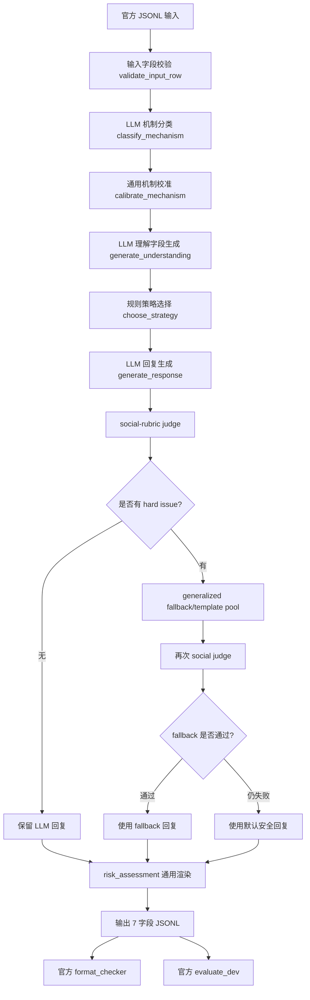

# BRAG 模型架构说明：v7b Generalized

## 1. 一句话概括

当前模型不是单纯的 prompt 方案，也不是只靠一个 LLM 端到端生成答案。它是一个面向 BRAG 任务的 **LLM + 规则校准 + 社会语用审查 + 官方格式验证** 的流水线系统。

核心目标有两个：

1. 在 public dev 上保持可验证提升。
2. 不使用 public-dev-specific 的硬编码规则，尽量降低 hidden test 过拟合风险。

当前推荐用于说明、复现和后续实验的版本是：

```text
v7b_generalized
= BRAG-Pipeline baseline
+ native Ollama / qwen3 support
+ generalized mechanism calibration
+ rule-based strategy matrix
+ evaluator-aware risk rendering
+ social-rubric judge
+ generalized response fallback/template pool
+ no-overfit stress checks
```

## 2. 当前分数位置

以下是目前已记录的 dev proxy 对比：

| 版本 | Proxy Dev | Mechanism | Strategy | Risk F1 | Response F1 | Format |
|---|---:|---:|---:|---:|---:|---:|
| baseline pipeline | 52.489 | 0.3333 | 0.6222 | 0.6074 | 0.1931 | 0 errors |
| v7 generalized | 60.764 | 0.6000 | 0.6444 | 0.6074 | 0.1818 | 0 errors |
| v7b calibrated | 72.440 | 0.8667 | 0.7222 | 0.7296 | 0.1602 | 0 errors |

最重要的提升来自：

| 提升点 | baseline | v7b | 变化 |
|---|---:|---:|---:|
| mechanism_accuracy | 0.3333 | 0.8667 | +0.5334 |
| strategy_score | 0.6222 | 0.7222 | +0.1000 |
| risk_label_f1 | 0.6074 | 0.7296 | +0.1222 |
| response_reference_token_f1 | 0.1931 | 0.1602 | -0.0329 |
| proxy_dev_score | 52.489 | 72.440 | +19.951 |

这里 response F1 下降了一点，是有意接受的代价。因为当前版本没有恢复 v6d_response_only 那种贴 public dev reference 的固定回复模板，所以不会靠 public dev 回复重构来冲分。

## 3. 总体架构



官方要求输出 7 个字段：

```text
episode_id
bragging_mechanism
speaker_intention
desired_feedback
risk_assessment
response_strategy
response_text
```

## 4. 模块说明

### 4.1 输入读取与输出组织

主要职责：

- 从官方 `dev_input.jsonl` 或 `test_input.jsonl` 读取样本。
- 保证每条输入都有官方字段。
- 对每条样本生成 7 字段输出。
- 写入 `submission.jsonl`。
- 自动调用官方 `format_checker.py` 和 dev 模式下的 `evaluate_dev.py`。

对应文件：

```text
BRAG-Pipeline-main/main.py
BRAG-Pipeline-main/config.py
BRAG-Pipeline-main/src/pipeline.py
BRAG-Pipeline-main/src/io_utils.py
BRAG-Pipeline-main/src/validators.py
```

这一层基本继承 baseline pipeline 的工程骨架，优点是清晰、可运行、方便换模型。

### 4.2 LLM 调用层

baseline pipeline 原本按 OpenAI-compatible API 调模型。后来本地 Ollama 的 `qwen3:8b` 在 `/v1/chat/completions` 路径上容易出现 reasoning 输出、空 content 或 502 问题。

因此 v7 加了 native Ollama 适配：

```text
OPENAI_BASE_URL=http://localhost:11434/v1
OPENAI_MODEL=qwen3:8b
```

当检测到 `localhost:11434` 或 `LLM_BACKEND=ollama` 时，不再走 OpenAI SDK，而是走 Ollama 原生：

```text
POST /api/chat
stream: false
think: false
```

这样可以禁用 qwen3 的 thinking/reasoning 输出，避免 `<think>` 内容污染 JSON 或 response_text。

对应文件：

```text
BRAG-Pipeline-main/src/llm_client.py
```

### 4.3 bragging_mechanism 机制分类

baseline 做法：

```text
speaker_post + context
-> LLM
-> bragging_mechanism
```

问题是本地小模型 qwen3:8b 对细粒度机制分类不稳定，尤其容易混淆：

```text
achievement_drop
understated_flex
faux_modesty
comparison_superiority
humble_complaint
scarcity_flex
self_aware_brag
```

v7b 的改动是：保留 LLM 分类，但在后面加一层 **通用机制校准**。

流程变成：

```text
LLM raw mechanism
-> safe_mechanism()
-> calibrate_mechanism(input_row, predicted_mechanism)
-> final mechanism
```

校准不是按 dev 样本 ID 或具体 public dev 文本硬修，而是按通用语言线索。

例子：

| 通用线索 | 倾向机制 | 解释 |
|---|---|---|
| `not to brag`, `humblebrag`, `flex` | `self_aware_brag` | 说话者显式知道自己在炫耀 |
| `better than`, `faster than`, `most`, `true skill` | `comparison_superiority` | 通过比较体现优越 |
| `invitation-only`, `limited`, `private preview`, `closed beta` | `scarcity_flex` | 强调稀缺机会或特殊权限 |
| `somehow`, `I guess`, `not sure how`, `apparently` | `faux_modesty` | 用谦虚或不确定语气突出优势 |
| `award`, `accepted`, `published`, `promotion`, `sold`, `finished` | `achievement_drop` | 顺手提到成就、结果、身份 |
| `tired`, `exhausted`, `too many notifications`, `kept asking` | `humble_complaint` | 抱怨本身在暗示能力、受欢迎或地位 |

这个模块是 v7b 分数提升最大的来源。mechanism 从 `0.3333` 提到 `0.8667`。

### 4.4 speaker_intention / desired_feedback / risk_assessment 理解字段

这一步仍然让 LLM 生成理解字段：

```text
input row
+ final bragging_mechanism
-> LLM JSON
-> speaker_intention
-> desired_feedback
-> risk_assessment
```

prompt 要求：

- 输出 compact JSON。
- 不输出 reasoning。
- 风险只写 1-2 个主要风险。
- 不要把所有风险都列出来。

对应文件：

```text
BRAG-Pipeline-main/src/prompts.py
BRAG-Pipeline-main/src/postprocess.py
```

但 risk_assessment 最终不会完全相信 LLM 原文，因为官方 evaluator 是按风险关键词识别的。如果模型写得自然但没有 evaluator 能识别的 label，risk F1 会吃亏。

所以 v7b 对 risk 做了规范化渲染。

### 4.5 risk_assessment 风险标签渲染

v7b 的 risk 不是简单“模型写什么就交什么”，而是：

```text
LLM risk text
-> 提取 evaluator-recognized risk labels
-> 根据 platform / relationship / interaction_goal / strategy 推断通用风险
-> render_risk_assessment(labels)
```

主要风险标签：

```text
misrecognition
context_insensitivity
sycophancy
preachiness
strategy_inconsistency
over_coldness
```

通用推断规则示例：

| 场景 | 更可能加入的风险 | 原因 |
|---|---|---|
| workplace / academic / public | `context_insensitivity` | 正式或公开环境更容易因为语气不合适出问题 |
| avoid_sycophancy 目标 | `sycophancy` | 任务明确要求避免过度捧场 |
| moralizing 目标/语境 | `preachiness` | 回复可能变成说教 |
| humor_tease / redirect / set_boundary | `strategy_inconsistency` | 策略执行不准会造成语气错配 |
| 默认大多数情况 | `misrecognition` | 低调炫耀容易被误读或误认 |

这样做的效果是把 risk F1 从 `0.6074` 提到 `0.7296`。

注意：这里不是按 dev gold 反推具体答案，而是让风险文本稳定包含官方 evaluator 能识别的通用关键词。

### 4.6 response_strategy 策略选择

这是和很多端到端 LLM 方案不同的地方。

当前架构里：

```text
response_strategy 不是 LLM 自由生成
response_strategy 由 choose_strategy() 本地规则决定
```

原因是 response_strategy 是官方评分项之一，而且小模型自由生成时容易：

- 标签不在枚举里。
- 策略和场景不匹配。
- 在 formal/public 场景中过度玩笑。
- 在 avoid_sycophancy 场景中过度 validate。

v7/v7b 的策略选择基于通用矩阵：

```text
platform
+ relationship
+ interaction_goal
+ bragging_mechanism
+ speaker_post 的少量通用语气 cue
-> response_strategy
```

主要策略：

```text
ask_followup
neutral_observation
light_acknowledgment
humor_tease
validate
redirect
set_boundary
no_response
```

规则例子：

| 条件 | 策略 | 解释 |
|---|---|---|
| `interaction_goal = stay_neutral` | `neutral_observation` | 目标已经要求中立 |
| workplace / academic | `neutral_observation` | 正式语境先克制 |
| professional + comparison | `redirect` | 避免继续强化优越比较 |
| avoid_sycophancy + 私聊 + 成就/低调炫耀 | `ask_followup` | 用追问代替夸赞 |
| close_friend + self-aware brag | `humor_tease` | 熟人场景可以轻微打趣 |
| comparison_superiority | `redirect` | 比较型炫耀更适合拉回主题 |

这一步把 strategy_score 从 `0.6222` 提到 `0.7222`。

### 4.7 response_text 回复生成

回复仍然先由 LLM 生成，但 prompt 做了约束：

- 只输出英文短回复。
- 不输出 JSON。
- 不暴露 label。
- 不直接说“you are bragging”。
- 避免过度赞美。
- 避免说教。
- 避免冷漠。
- 尽量使用 post 中一个具体细节。
- 如果策略是 `ask_followup`，只问一个问题。
- 如果策略是 `neutral_observation`，保持克制观察。

对应文件：

```text
BRAG-Pipeline-main/src/prompts.py
BRAG-Pipeline-main/src/postprocess.py
```

### 4.8 social-rubric judge

LLM 回复生成后，不直接交付，而是经过一个本地社会语用 judge。

它检查：

```text
strategy_fit
anti_sycophancy
anti_preachiness
context_fit
naturalness
```

hard issue 示例：

| hard issue | 触发情况 |
|---|---|
| `followup_without_question` | 策略是 ask_followup，但回复没有问号 |
| `redirect_not_marked` | 策略是 redirect，但没有体现拉回主题 |
| `overpraise_in_cautious_context` | avoid_sycophancy 或 neutral 场景里用了强夸 |
| `moralizing_instruction` | 出现 you should / be humble 等说教 |
| `casual_tease_in_constrained_context` | 正式语境里用了太随意的 teasing |

对应文件：

```text
BRAG-Pipeline-main/src/social_rubric.py
```

如果没有 hard issue：

```text
保留 LLM 原回复
```

如果有 hard issue：

```text
使用 generalized fallback/template pool 重写一次
```

如果 fallback 仍然不通过：

```text
使用默认安全回复
```

### 4.9 generalized fallback/template pool

fallback 的原则是：

```text
只按 strategy + mechanism + context 选模板
不按具体 dev/test 文本
不按 episode_id 写死答案
不贴 reference response
```

模板风格是抽象通用的，例如：

| Strategy | 模板方向 |
|---|---|
| ask_followup | 问一个自然后续问题 |
| neutral_observation | 中性观察，不强夸 |
| humor_tease | 轻微打趣，避免攻击 |
| validate | 温和认可，不奉承 |
| redirect | 承认信息后拉回主题 |
| set_boundary | 克制设边界 |
| light_acknowledgment | 小幅承认，不展开 |

为了可复现，模板选择使用 deterministic hash，而不是随机数。

## 5. 和 baseline pipeline 的核心区别

| 层级 | baseline pipeline | 当前 v7b generalized |
|---|---|---|
| 工程链路 | 已跑通 | 保留 |
| LLM 调用 | OpenAI-compatible 为主 | 加 native Ollama `/api/chat`，禁用 qwen3 thinking |
| mechanism | LLM 直接输出 | LLM + 通用机制校准 |
| understanding | LLM 生成 | LLM 生成 + 清洗 |
| strategy | 基础规则 | 通用策略矩阵 |
| risk | 模型文本为主 | evaluator-aware 通用风险渲染 |
| response | LLM 回复 | LLM 回复 + social judge + fallback |
| overfit 检查 | 较少 | dev-specific keyword scan + stress set |
| 目标 | 工程验证 | 稳健提分 |

## 6. 和 v6d_response_only 的区别

v6d_response_only 是 public dev 高分参考版，public dev 分非常高，但存在明显过拟合信号：

- response_reference_token_f1 达到 1.0000。
- 多条 response_text 和 dev gold reference 完全一致。
- 存在具体 public dev 实体和短语规则。

v7b generalized 刻意不采用这种路线：

```text
不使用具体 dev 实体
不使用 TOPIC_RULES
不使用 high_confidence_response
不读取 dev_gold
不贴 reference_response
不按 episode_id 写固定答案
```

所以 v7b 的 response F1 不会像 v6d_response_only 那么高，但 hidden test 风险更低。

## 7. 过拟合控制原则

当前模型允许使用：

```text
platform
relationship
agent_role
interaction_goal
speaker_post 的通用语言线索
模型原始输出
官方 label schema
官方 evaluator 的风险关键词
```

当前模型禁止使用：

```text
dev_gold
reference_response
episode_id -> 固定答案
具体 public dev 实体
具体 public dev topic
看过 dev reference 后手写的固定回复
```

典型禁止例子：

```text
if "lollapalooza" in post:
    return fixed_response

if "hollie" in post and "oklahoma" in post:
    mechanism = ...

if episode_id == "...":
    response_text = ...
```

允许的泛化例子：

```text
if platform in {"workplace_channel", "academic_forum"}:
    strategy = "neutral_observation"

if "not to brag" in speaker_post.lower():
    mechanism = "self_aware_brag"

if interaction_goal contains "avoid_sycophancy":
    risk labels include "sycophancy"
```

## 8. 为什么这些改动能提分

### 8.1 mechanism 提升

官方总分里 mechanism 是很重要的一项。小模型 raw 分类不稳，所以加通用校准后收益很大。

```text
baseline pipeline mechanism = 0.3333
v7b mechanism = 0.8667
```

这说明 qwen3:8b 本身不是完全不能用，而是需要规则校准帮助它稳定落到官方枚举。

### 8.2 strategy 提升

strategy 不适合完全交给小模型自由发挥。用规则矩阵以后，它更稳定地匹配平台、关系和目标。

```text
baseline pipeline strategy = 0.6222
v7b strategy = 0.7222
```

### 8.3 risk 提升

官方 risk F1 对关键词比较敏感。如果自然语言没有包含 evaluator 能识别的 label，就会丢分。

v7b 通过通用渲染稳定输出风险关键词：

```text
baseline pipeline risk = 0.6074
v7b risk = 0.7296
```

### 8.4 response F1 暂时不是主攻方向

response_reference_token_f1 从 `0.1931` 降到 `0.1602`，说明当前回复没有贴近 public dev reference。

这不是完全理想，但比恢复 dev-specific 固定模板更稳。后续如果继续优化 response，应该走：

```text
通用自然度增强
通用 template diversity
基于策略的回复风格约束
非 dev stress set 验证
```

而不是恢复 public dev 的具体回答模板。

## 9. 当前版本适合怎么对外介绍

可以这样介绍：

```text
我们的模型采用分层 BRAG pipeline。
第一层用本地 qwen3 生成机制分类、社交理解和回复草稿；
第二层用通用规则校准 bragging mechanism；
第三层用 platform、relationship、interaction_goal 和 mechanism 组成策略矩阵选择 response_strategy；
第四层把 risk_assessment 渲染成 evaluator 能识别的通用风险标签；
第五层用 social-rubric judge 检查回复是否过度赞美、说教、语境不匹配或策略不一致；
如果回复有 hard issue，就回退到 generalized template fallback。
整个系统不使用 public dev 具体实体、episode 或 reference response，重点是 hidden test 泛化稳健性。
```

## 10. 运行方式

### 10.1 环境变量

本地 Ollama qwen3:

```bash
export OPENAI_BASE_URL=http://localhost:11434/v1
export OPENAI_MODEL=qwen3:8b
export OPENAI_API_KEY=ollama
```

如果使用其他 OpenAI-compatible 服务：

```bash
export OPENAI_BASE_URL=你的服务地址
export OPENAI_MODEL=你的模型名
export OPENAI_API_KEY=你的 key
```

### 10.2 smoke test

建议先跑 3 条：

```python
MODE = "dev"
MAX_ITEMS = 3
RUN_OFFICIAL_FORMAT_CHECK = True
RUN_DEV_EVAL = True
```

目标：

```text
确认模型服务连通
确认输出 JSONL 格式正确
确认 official checker 能跑
```

### 10.3 full dev

完整 dev 45 条：

```python
MODE = "dev"
MAX_ITEMS = None
RUN_OFFICIAL_FORMAT_CHECK = True
RUN_DEV_EVAL = True
```

重点看：

```text
proxy_dev_score
mechanism_accuracy
strategy_score
risk_label_f1_from_risk_assessment
response_reference_token_f1
format error_count
```

### 10.4 test

test 没有 gold，只看格式：

```python
MODE = "test"
MAX_ITEMS = None
RUN_OFFICIAL_FORMAT_CHECK = True
RUN_DEV_EVAL = False
```

目标：

```text
409/409 rows
0 errors
0 warnings
```

## 11. 当前风险和下一步

### 当前风险

| 风险 | 说明 | 当前处理 |
|---|---|---|
| response F1 偏低 | 没有贴 public dev reference | 接受，避免过拟合 |
| qwen3:8b 理解能力有限 | 小模型对细粒度语用理解不稳定 | 用规则校准和 judge 补强 |
| 规则仍可能误伤 hidden | 即使是通用规则也可能有边界问题 | 用 stress set 和 no-overfit scan 检查 |
| full test 运行耗时 | 409 条，每条多次模型调用 | 先 smoke，再 full dev，再 test |

### 下一步优先级

| 优先级 | 任务 | 目标 |
|---:|---|---|
| 1 | 分析 v7b 剩余 mechanism 错例 | 从 0.8667 继续提升，但不能按 dev case 硬修 |
| 2 | 优化 strategy matrix | 提高 preferred_strategy_accuracy |
| 3 | 加强 response 通用自然度 | 提高 response F1 和自然度，不恢复 dev-specific 模板 |
| 4 | 跑 full test format | 确认 409 条 0 errors |
| 5 | 扩展 no-overfit stress set | 验证 hidden 风险 |

## 12. 最终结论

当前模型的本质是：

```text
本地小模型负责生成语义草稿；
规则系统负责稳定官方标签；
social judge 负责防止回复风格失控；
official checker 负责最终格式和 dev proxy 验证。
```

它相对于 baseline pipeline 的核心提升不是换了更大的模型，而是把 BRAG 任务拆成了更可控的几个子问题：

```text
机制分类要校准
策略选择要规则化
风险文本要 evaluator-aware
回复生成要被社会语用规则审查
过拟合要被显式扫描
```

因此 v7b 能在不引入 public dev 高风险硬编码的情况下，把 dev proxy 从 `52.489` 提到 `72.440`，同时保持官方格式检查 0 errors。
